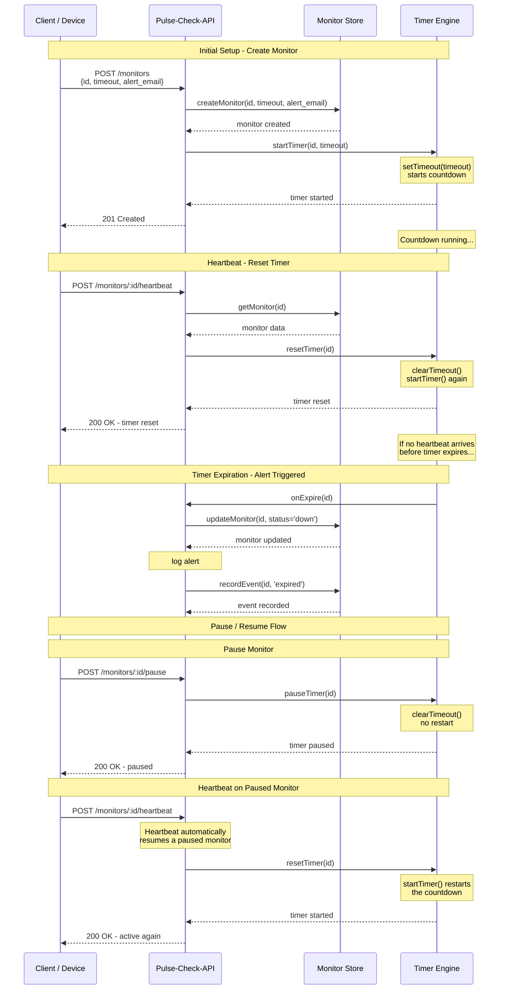

# Pulse-Check-API (Watchdog Sentinel)

A Dead Man's Switch REST API built for CritMon Servers Inc. — monitors remote devices (solar farms, weather stations) that send periodic "I'm alive" heartbeats. If a device stops checking in before its timeout expires, the system automatically fires an alert.

Built with **pure Node.js** — no frameworks, no external dependencies. Every piece of routing, timer management, and request handling is hand-rolled to demonstrate an understanding of what frameworks like Express normally abstract away.

## Architecture Diagram

The core flow: a device registers a monitor, then must "heartbeat" before its timeout expires or an alert fires automatically.



## Setup Instructions

**Requirements:** Node.js 18+ (no `npm install` needed — zero external dependencies)

```bash
git clone https://github.com/kkanim/Pulse-Check-API.git
cd Pulse-Check-API
git checkout feat/deadmans-switch
npm start
```

Server starts at `http://localhost:3000`. Use `npm run dev` instead for auto-restart on file changes during development.

## API Documentation

### `POST /monitors`
Registers a new monitor and starts its countdown immediately.

**Request:**
```json
{ "id": "device-123", "timeout": 60, "alert_email": "admin@critmon.com" }
```

**Response — `201 Created`:**
```json
{
  "message": "Monitor \"device-123\" created successfully",
  "monitor": { "id": "device-123", "timeout": 60, "status": "active", "...": "..." }
}
```

**Errors:** `400` (validation failure), `409` (id already exists)

---

### `POST /monitors/:id/heartbeat`
Resets the countdown. If the monitor was paused, this also resumes it.

**Response — `200 OK`:**
```json
{ "message": "Heartbeat received for \"device-123\". Timer reset.", "monitor": { "...": "..." } }
```

**Errors:** `404` (unknown id)

---

### `POST /monitors/:id/pause`
Freezes the countdown entirely. No alerts fire while paused.

**Response — `200 OK`:**
```json
{ "message": "Monitor \"device-123\" paused. No alerts will fire until the next heartbeat.", "monitor": { "...": "..." } }
```

**Errors:** `404` (unknown id)

---

### `GET /alerts`
Returns all fired alerts, newest first.

**Response — `200 OK`:**
```json
{ "count": 1, "alerts": [{ "monitorId": "device-123", "message": "Device device-123 is down!", "firedAt": "..." }] }
```

---

### `GET /monitors/:id/history`
Returns the full event timeline for a monitor (creation, heartbeats, pauses, expiry), oldest first, alongside its current state.

**Response — `200 OK`:**
```json
{
  "monitor": { "id": "device-123", "status": "active", "...": "..." },
  "eventCount": 3,
  "history": [
    { "monitorId": "device-123", "type": "created", "detail": { "timeout": 60 }, "timestamp": "..." },
    { "monitorId": "device-123", "type": "heartbeat", "detail": {}, "timestamp": "..." },
    { "monitorId": "device-123", "type": "paused", "detail": {}, "timestamp": "..." }
  ]
}
```

**Errors:** `404` (unknown id)

## Developer's Choice: Event History Tracking

**What I added:** a `GET /monitors/:id/history` endpoint that records and returns a full event timeline for every monitor — creation, every heartbeat, every pause, and every expiry — each with its own timestamp.

**Why I added it:** the base API only exposes a monitor's *current* state. In a real incident — say a solar farm monitor goes down at 3am — a support engineer's first question isn't "what's its status now," it's "what happened, and when." Without a history, debugging why an alert fired (or didn't) means guessing. This feature turns the API from a simple status-check tool into something that supports actual incident investigation, which is the difference between a toy monitoring system and one that's operationally useful.

**Design decision:** I kept event history as a separate store (`eventStore.js`) from the alerts store (`alertStore.js`), since alerts are a specific type of event (a down-trigger) while history is the complete lifecycle audit trail — conflating the two would have made alerts noisier and history less complete.

## Known Limitations

- **In-memory only:** all monitor and event data is lost on server restart. This was a deliberate choice — the brief doesn't call for persistence, and the core challenge (stateful timers) can't be solved by a database anyway. In production, monitor *definitions* would be persisted, with live countdowns re-hydrated on boot.
- **Single-process:** timers live in this one Node process's memory; horizontally scaling would need a shared timer/state coordination layer (e.g. Redis-backed schedule).